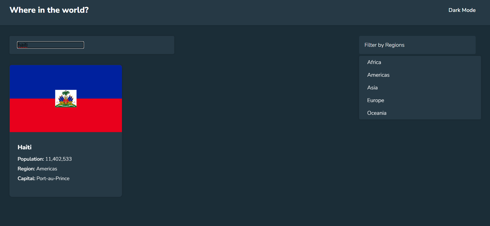

# Frontend Mentor - REST Countries API with color theme switcher solution

This is a solution to the [REST Countries API with color theme switcher challenge on Frontend Mentor](https://www.frontendmentor.io/challenges/rest-countries-api-with-color-theme-switcher-5cacc469fec04111f7b848ca). Frontend Mentor challenges help you improve your coding skills by building realistic projects. 

## Table of contents

- [Overview](#overview)
  - [The challenge](#the-challenge)
  - [Screenshot](#screenshot)
  - [Links](#links)
- [My process](#my-process)
  - [Built with](#built-with)
  - [Continued development](#continued-development)
  - [Useful resources](#useful-resources)
- [Author](#author)

## Overview

### The challenge

Users should be able to:

- See all countries from the API on the homepage
- Search for a country using an `input` field
- Filter countries by region
- Click on a country to see more detailed information on a separate page
- Click through to the border countries on the detail page
- Toggle the color scheme between light and dark mode *(optional)*

### Screenshot

### Links

- Solution URL: (https://github.com/han19githtbr/rest-api-country-test-crosoften.git)
- Live Site URL: (https://test-api-rest-countries-handy.netlify.app/)

## My process

### Built with

- Semantic HTML5 markup
- SCSS custom properties
- SCSS Grid
- [Angular](https://angular.io/) - Framework

### Useful resources

- [Example resource 1](https://github.com/topics/rest-countries-api) - These topics helped me to have Various ways to develop the application

## Author

- Website - [Handy Claude Marie Milliance](https://portfolio-handy.netlify.app/)
- Frontend Mentor - [@yourusername](https://www.frontendmentor.io/profile/yourusername)
- Twitter - [@yourusername](https://www.twitter.com/yourusername)
